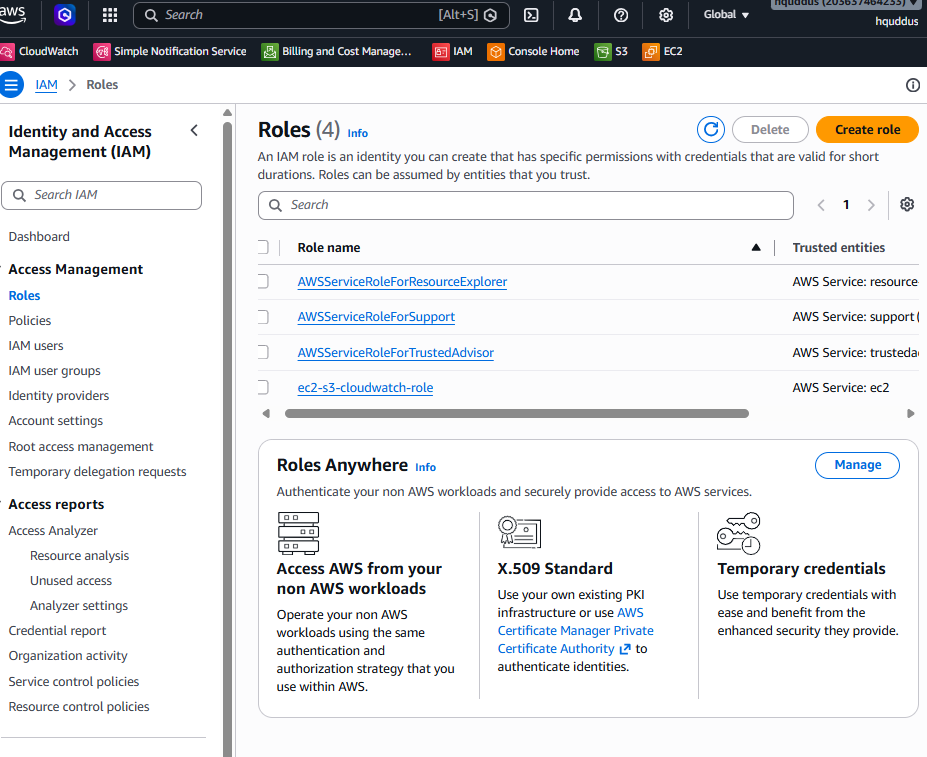
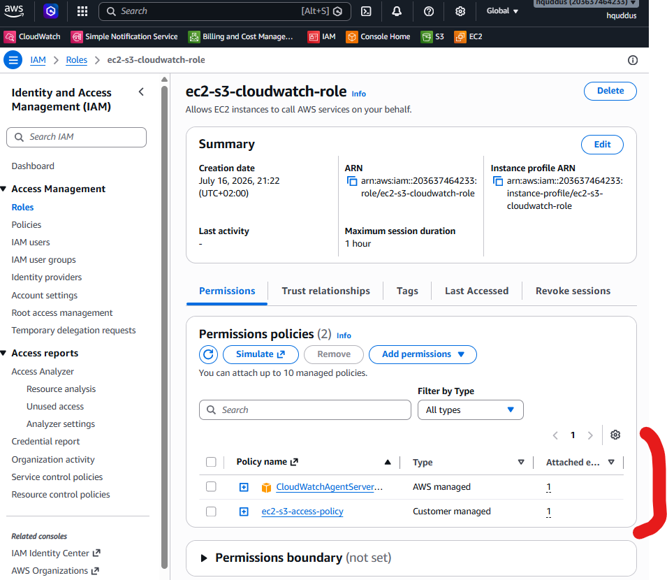
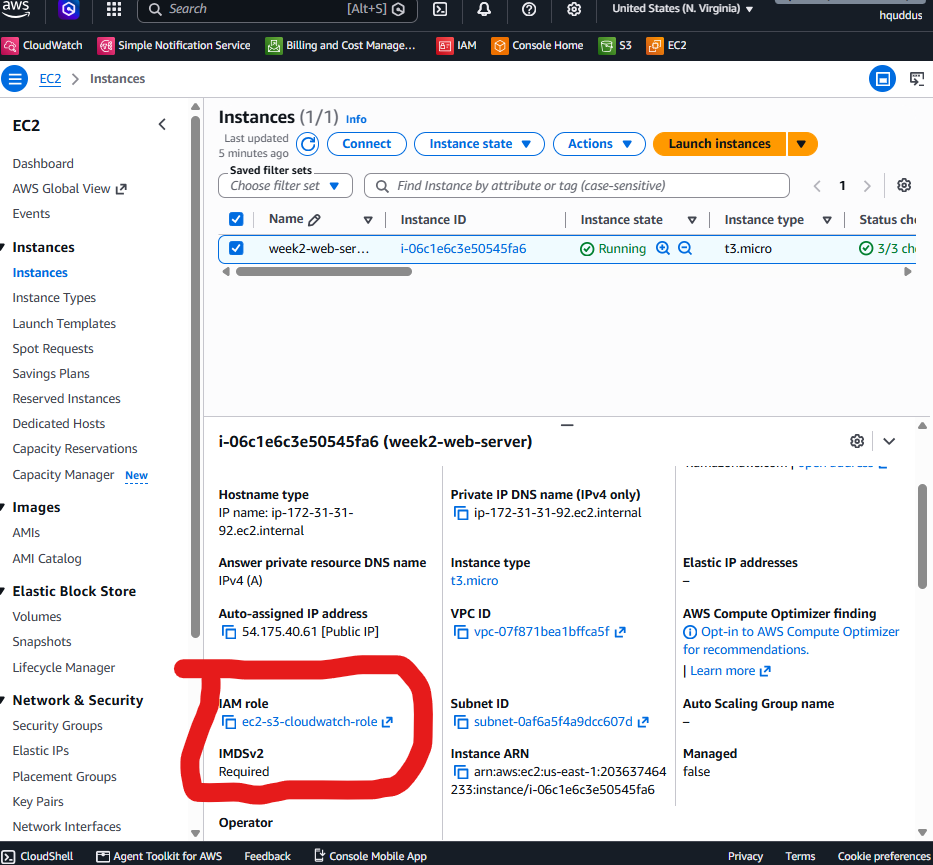
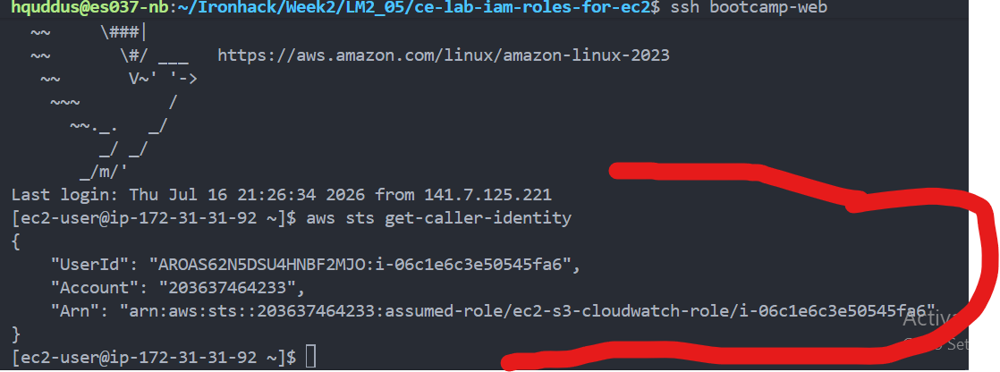
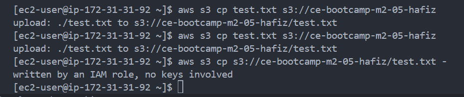
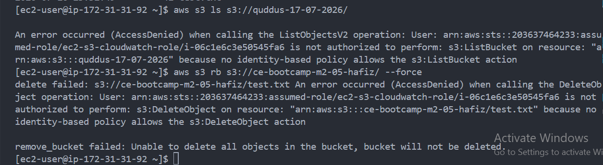

# IAM Roles for EC2 Lab - Solution

**Student Name:** Hafiz Abdul Quddus
**Date Completed:** 17-07-2026

---

# Environment Details

| Item           | Value                   |
| -------------- | ----------------------- |
| Instance ID    | i-06c1e6c3e50545fa6     |
| Region         | usa-west-1              |
| S3 Bucket Name | ce-bootcamp-m2-05-hafiz |
| Policy Name    | ec2-s3-access-policy    |
| Role Name      | ec2-s3-cloudwatch-role  |

---

# Step 1: Create an S3 Bucket

- [X] Bucket created with `aws s3 mb`
- [X] Bucket appears in `aws s3 ls`

**My bucket name:** `ce-bootcamp-m2-05-hafiz`

---

# Step 2 & 3: Create the Custom Policy

- [X] Policy `ec2-s3-access-policy` created from the JSON
- [X] Both `YOUR-BUCKET-NAME` placeholders replaced with my real bucket
- [X] `Resource` has **both** ARNs (bucket and objects)

### Why does the policy need two ARNs (one with `/*`, one without)?

```
S3 has two resource types:

arn:aws:s3:::YOUR-BUCKET-NAME → the bucket itself (used for s3:ListBucket).
arn:aws:s3:::YOUR-BUCKET-NAME/* → the objects in the bucket (used for s3:GetObject, s3:PutObject, etc.).
```

---

# Step 4: Create the IAM Role

## Screenshot 1 – Role Creation

```
screenshots/01-role-creation.png
```



## Screenshot 2 – Policy Attachment

```
screenshots/02-policy-attachment.png
```



---

- [X] Role `ec2-s3-cloudwatch-role` created with **EC2** trusted entity
- [X] `CloudWatchAgentServerPolicy` attached
- [X] `ec2-s3-access-policy` attached

---

# Step 5: Attach the Role to Your Instance

## Screenshot 3 – EC2 with Role

```
screenshots/03-ec2-with-role.png
```



---

- [X] Role attached via **Actions → Security → Modify IAM role**
- [X] Instance **Details** tab shows the IAM role

---

# Step 6: Confirm No Credentials Exist on the Instance

- [X] Ran `ls -la ~/.aws/` on the instance
- [X] No `~/.aws/credentials` file present (deleted it if it existed)

---

# Step 7: Test the Role

## Screenshot 4 – Assumed-Role Identity

```
screenshots/04-assumed-role-identity.png
```



## Screenshot 5 – S3 Upload Success

```
screenshots/05-s3-upload-success.png
```



---

- [X] `aws sts get-caller-identity` shows `assumed-role/`, not `user`
- [X] `aws s3 ls s3://YOUR-BUCKET-NAME/` works
- [X] Upload (`aws s3 cp test.txt ...`) works
- [X] Read-back works
- [X] I never typed a credential

### The `Arn` from `get-caller-identity`

```text
[ec2-user@ip-172-31-31-92 ~]$ # Who am I?
aws sts get-caller-identity
{
    "UserId": "AROAS62N5DSU4HNBF2MJO:i-06c1e6c3e50545fa6",
    "Account": "203637464233",
    "Arn": "arn:aws:sts::203637464233:assumed-role/ec2-s3-cloudwatch-role/i-06c1e6c3e50545fa6"
}
```

---

# Step 8: Test Least Privilege

## Screenshot 6 – Access Denied Proof

```
screenshots/06-access-denied-proof.png
```



---

- [X] Listing a bucket I was not granted → `AccessDenied`
- [X] `aws s3 rb` (delete, not granted) → `AccessDenied`

---

# Step 9: Capture the Trust Policy

- [X] Ran `aws iam get-role ...` **from my laptop** (not the instance)
- [X] Saved output as `trust-policy.json`
- [X] Trust policy `Principal` is `ec2.amazonaws.com`

---

# Step 10: Locate the Source of the Credentials

- [X] Fetched an IMDSv2 token, then read the role credentials from `169.254.169.254`
- [X] Response includes `AccessKeyId`, `SecretAccessKey`, `Token`, and an `Expiration`

```
hxxx@xx:~/Ironhack/Week2/LM2_05/ce-lab-iam-roles-for-ec2$ # Step 1: request a short-lived session token (required by IMDSv2)
TOKEN=$(curl -sX PUT "http://169.254.169.254/latest/api/token" \
  -H "X-aws-ec2-metadata-token-ttl-seconds: 300")

# Step 2: use the token to read the role's temporary credentials from the metadata service
curl -sH "X-aws-ec2-metadata-token: $TOKEN" \
  http://169.254.169.254/latest/meta-data/iam/security-credentials/ec2-s3-cloudwatch-role


#Output

{
  "Code" : "Success",
  "LastUpdated" : "2026-07-17T00:47:17Z",
  "Type" : "AWS-HMAC",
  "eyId" : "AXXXXXXXXXXXXXXXBYI",
  "sKey" : "mrq3xSrVXXXXXXXXgd5Y",
  "Token" : "IQoJb3JpZ2luX2VXXXXE6TZ3QolhsIFDedub2VhQkRNI=",
  "Expiration" : "2026-07-17T07:21:59Z"
}[ec2-user@ip-172-31-31-92 ~]$ 
```

---

# Cleanup

- [X] Emptied and deleted the S3 bucket (`aws s3 rb ... --force`)
- [X] Instance **stopped** (not terminated)
- [X] IAM role left in place (costs nothing)

---

# Submission Checklist

Repository name: `ce-lab-iam-roles-ec2` (**public**)

- [X] `policies/s3-cloudwatch-policy.json` and `policies/trust-policy.json` committed
- [X] `test-output/` files committed (commands, S3 test, access-denied test)
- [X] All 6 screenshots present
- [X] `README.md` complete with reflections
- [X] Policy uses **both** ARN forms
- [X] `get-caller-identity` shows `assumed-role/`
- [X] `~/.aws/credentials` does **not** exist on the instance
- [X] Account ID redacted (if I chose to)
- [X] Repository URL submitted
